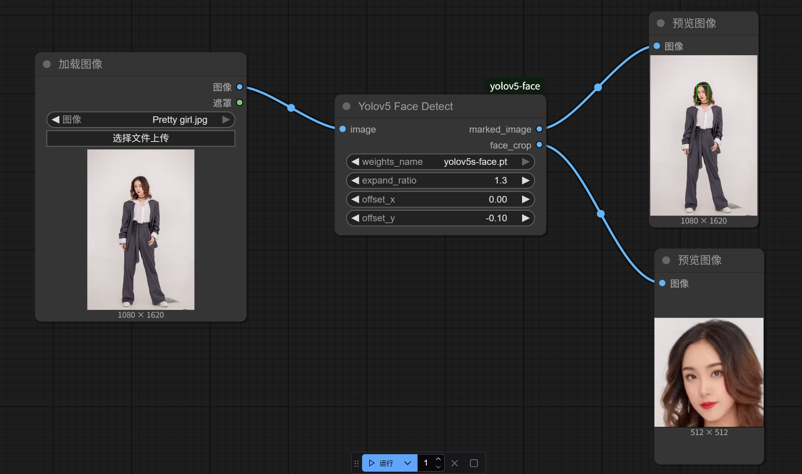

[🇨🇳 中文说明](./README.zh-CN.md)
# ComfyUI YOLOv5-Face Detection Custom Node

A custom node for [ComfyUI](https://github.com/comfyanonymous/ComfyUI) that enables face detection in images using models from [deepcam-cn/yolov5-face](https://github.com/deepcam-cn/yolov5-face).

---

## Features

- **Face Detection:** Detect faces in images using YOLOv5-based models.
- **Easy Integration:** Simple installation and usage within ComfyUI workflows.

---

## Installation

1. **Clone this repository** into your ComfyUI custom nodes directory.

2. **Install dependencies:**  
   Run the following command in the project directory:

   ```
   pip install -r requirements.txt
   ```

---

## Model Download

This custom node requires YOLOv5-face models to function.  
Supported models:

- `yolov5n-0.5`
- `yolov5n`
- `yolov5s`
- `yolov5m`
- `yolov5l`

**How to download:**

1. Go to the [YOLOv5-face Data Preparation section](https://github.com/deepcam-cn/yolov5-face?tab=readme-ov-file#data-preparation).
2. Download the required model files (`.pt` format).
3. Place the downloaded model files into the following directory in your ComfyUI installation:

   ```
   ComfyUI/models/yolov5
   ```

   If the directory does not exist, create it manually.

---

## Usage

1. Start ComfyUI.
2. Add the Yolov5 Face Detect node to your workflow.
3. Select one of the available models.
4. Run the workflow to detect faces in your images.

### Example

The following image shows an example of face detection results:



---

## References

- [deepcam-cn/yolov5-face](https://github.com/deepcam-cn/yolov5-face)
- [ComfyUI](https://github.com/comfyanonymous/ComfyUI)

---

## License

Refer to the LICENSE file for details.
