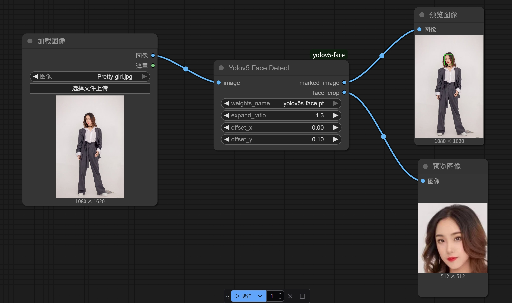

[🇺🇸 English Version](./README.md)
# ComfyUI YOLOv5-Face 人脸检测自定义节点

本项目为 [ComfyUI](https://github.com/comfyanonymous/ComfyUI) 提供了一个自定义节点，基于 [deepcam-cn/yolov5-face](https://github.com/deepcam-cn/yolov5-face) 项目实现图像的人脸检测。

---

## 功能介绍

- **人脸检测：** 基于 YOLOv5 模型对图片进行人脸检测。
- **易于集成：** 可直接在 ComfyUI 工作流中使用。

---

## 安装方法

1. **克隆本项目** 到你的 ComfyUI 自定义节点目录下。

2. **安装依赖：**  
   在项目目录下运行以下命令：

   ```
   pip install -r requirements.txt
   ```

---

## 模型下载

本节点需要 YOLOv5-face 模型文件支持。  
支持的模型包括：

- `yolov5n-0.5`
- `yolov5n`
- `yolov5s`
- `yolov5m`
- `yolov5l`

**下载方式：**

1. 访问 [YOLOv5-face 数据准备部分](https://github.com/deepcam-cn/yolov5-face?tab=readme-ov-file#data-preparation)。
2. 下载所需的模型文件（`.pt` 格式）。
3. 将下载的模型文件放入 ComfyUI 安装目录下的以下路径：

   ```
   ComfyUI/models/yolov5
   ```

   如果该目录不存在，请手动创建。

---

## 使用方法

1. 启动 ComfyUI。
2. 在工作流中添加Yolov5 Face Detect 人脸检测节点。
3. 选择所需的模型。
4. 运行工作流，对图片进行人脸检测。

### 示例

下图展示了人脸检测的示例效果：



---

## 参考项目

- [deepcam-cn/yolov5-face](https://github.com/deepcam-cn/yolov5-face)
- [ComfyUI](https://github.com/comfyanonymous/ComfyUI)

---

## 许可证

详见 LICENSE 文件。
